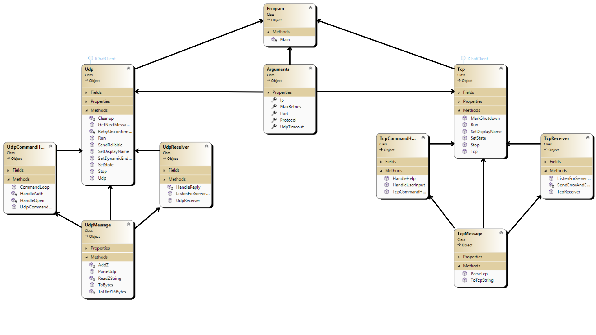
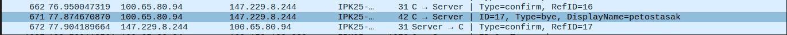

# IPK Projekt 1 - DOKUMENTÁCIA

### Autor: Filip Botlo / xbotlo01

## Zhrnutie zadania 

Cieľom projektu bola implementácia klientskej aplikácie, ktorá komunikuje so serverom cez IPK25-CHAT protokol. Aplikácia môže na základe vybraných argumentov využívať transportný protokol TCP aj UDP.

## Ako sa pri riešení projektu využilo LLM
Pre vypracovanie projektu som používal aj Large Language Model - ChatGPT nasledujúcimi spôsobmi:

- vygenerovanie šablóny pre túto dokumentáciu, sformátovanie použitých zdrojov do bibliografickej podoby
- konzultácia pri návrhu tried a možnostiach .NETu pre tento projekt
- pomoc pri reštruktualizácii kódu pre lepšiu čitateľnosť
- tvorba Makefile
- generovanie niektorých častí kódu ako alternatív k mojim riešeniam

Výstupy LLM boli kontrolované a použité ako doplnkový, najmä konzultačný nástroj. 


## Obsah
- [Krátke teoretické pozadie Transportu](#krátke-teoretické-pozadie)
- [Štruktúra aplikácie](#štruktúra-aplikácie)
- [Implementácia aplikácie](#implementácia-aplikácie)
- [Testovanie a overenie funkcionality](#testovanie-a-overenie-funkcionality)
- [Známe obmedzenia a nedostatky](#známe-obmedzenia-a-nedostatky)
- [Zdroje a použité materiály](#zdroje-a-použité-materiály)


## Krátke teoretické pozadie UDP a TCP

#### TCP (Transmission Control Protocol)

TCP je protokol, ktorý pred prenosom dát spraví tzv. 3-way handshake - klient pošle žiadosť o nadviazanie spojenia cez SYN, Server potvrdí prijatie cez ACK na danú správu a klient to potom potvrdí tiež cez ACK, čím sa nadviaže spojenie. Protokol si čísluje segmenty a kontroluje poradie.

TCP klient v projekte používa triedu `Socket` na pripojenie a posiela správy povolených príkazov (napr AUTH), pri ktorých potom čaká na odpovede od servera. Statový automat potom určuje, ktoré príkazy sú kedy povolené.  

#### UDP (User Datagram Protocol)

UDP je protokol, ktorý nenadväzuje spojenie, takže sa správy pošlu rýchlejšie ale správy sa môžu stratiť.

 UDP klient v projekte využíva `UdpClient` a implementuje logiku spolahlivosti:
 - ku správam je pridelené jedinečné MessageId
 - u spŕav sa čaká na Confirm alebo Reply 
 - pri zlyhaní Confirm správi sa správa posiela znovu
 - stavový automat určuje, ktoré príkazy sú kedy povolené


## Štruktúra aplikácie
**UML diagram s architektúrou tried rozdelenou na TCP a UDP vetvu:**




## Implementácia aplikácie

#### Program.cs
Hlavný vstup programu, ktorý spracuje počiatočné argumenty a podľa prepínača -t určí, či sa vytvorí TCP alebo UDP varianta klienta. Potom sa to spustí cez funkciu `Run` a pre ukončenie volá funckiu `Stop`.

Argumenty sú načítané do public record `Arguments` s predvolenými hodnotami pre nepovinné parametre. 
Možné parametre sú:

- `-t` typ protokolu (tcp alebo udp)
- `-s` IP adresa alebo hostname servera
- `-p` port
- `-d` timeout pre UDP
- `-r` maximálny počet retry pokusov pri UDP
- `-h` pomocné hlásenie o parametroch

### TCP Varianta

#### Tcp.cs
Trieda `Tcp` inicializuje Tcp spojenie so serverom cez `Stream Socket` a vytvára pomocné triedy `TcpCommandHandler` a `TcpReciever`.

#### TcpCommandHandler.cs
Trieda `TcpCommandHandler` využíva funckiu `HandleUserInput`, v ktorej číta vstup užívateľa v konzole a potom na to reaguje v závislosti od spŕavnosti príkazu aj aktuálneho stavu. Následne vytvorí `TcpMessage` poďla zadaného príkazu alebo textu (MSG) a potom to pošle.

#### TcpReceiver.cs
Trieda prijíma správy zo servera vo funkcii `ListenForMessages()` a vypisuje informácie z nich do konzoly pre užívateľa. Rozpoznáva ich pomocou funkcie `ParseTcp()` z treidy `TcpMessage`.

#### TcpMessage.cs
Táto trieda slúži na reprezenaciu všetkých možných správ a na základe typu správy ju potom vo funkcii `ParseTcp()` parsuje alebo vo funkcii `ToTcpString()` konštruuje.

### UDP Varianta

#### Udp.cs
Trieda `Udp` Inicializuje triedu `UdpClient`. Rovnako ako u TCP má 2 pomocné triedy na spracovanie vstupu od užívateľa - `UdpCommandHandler` a správ od serveru - `UdpReceiver`. 

#### UdpCommandHandler.cs
Trieda využíva funckiu `HandleUserInput`, v ktorej využíva samostatnú funkciu, ktorá rieši autentikáciu - `HandleAuth()` a funckiu, ktorá spracúva príkazy v Open stave podobne ako u TCP.

#### UdpReceiver.cs
Trieda prijíma správy zo servera vo funkcii `ListenForMessages()` a vypisuje informácie z nich do konzoly pre užívateľa. Rozpoznáva ich pomocou funkcie `ParseUdp()` z treidy `UdpMessage`.


#### UdpMessage
Táto trieda slúži na reprezenaciu všetkých možných správ a na základe typu správy ju potom vo funkcii `ParseUdp()` parsuje alebo vo funkcii `ToBytes()` konštruuje.


Bližšie informácie o implementácii možno pozrieť priamo v spomínaných súboroch aj s komentármi.

## Testovanie a overenie funkcionality

#### Čo sa testovalo

- Odozva na príkazy užívateľa
- Správy na výstupe podľa špecifikácie
- Odchyt chýb a výpis 

#### Prečo sa testovalo

- Správne fungovanie príkazov 
- Zaručenie spoľahlivého prenosu v UDP variante
- Dodržanie postupu komunikácie

### # Ako sa testovalo

- Referenčný server `anton5.fit.vutbr.cz`
- Testovanie rôznych príkazov a výstupov na CLI
- Sledovanie komunikácie v aplikácii Wireshark
- Automatické, verejne dostupné študentské testy 

### Testovanie TCP Varianty

#### Automatické testy


Bol odtránený test na SIGINT, nakoľko mi neprechádzal, ale manuálne to fungovalo keď som to testoval.

#### Testy v konzole a odchytenie Wiresharku:

Chyba pri poslaní správy bez autentikácie:
```bash
$ ./ipk25chat-client -t tcp -s anton5.fit.vutbr.cz
aaa
ERROR: You must be authenticated before sending messages
```

Pomocná správa:
```bash
/help
Available commands:
/auth <username> <secret> <displayName>
/join <channelId>
/rename <displayName>
/help
```

Neúspešná autentikácia konzola:
```bash
/auth a b c 
Action Failure: Authentication failed - Provided user secret is not valid.
```

Neúspešná autentikácia Wireshark:


Autentikácia koznola:
```bash
$ ./ipk25chat-client -t tcp -s anton5.fit.vutbr.cz
/auth xbotlo01 2c38aeb2-300e-4825-9985-fcaefab0de84 
Action Success: Authentication successful.
Server: petocmorik has joined `discord.general` via TCP.
Server: steve has joined `discord.general` via UDP.
```
Autentikácia Wireshark:


Join konzola a správa:
```bash
/join discord.test
Action Success: Channel discord.test successfully joined.
Server: petocmorik has switched from `discord.general` to `discord.test`.
```

Join Wireshark a správa:


Rename koznola:
```bash
/rename mekyzbirka
Renamed to mekyzbirka
mam rad tien jabloni 
aladix@aladix-Aspire:~/Desktop/FIT/ipk/ipk25/IPK25-CHAT$
```
Rename Wireshark:


Ukončenie Ctrl + C pošle BYE a skončí aplikáciu.

### Testovanie UDP Varianty

#### Automatické testy


V UDP bol problém s testom poslania Bye a ukončenia aplikácie. Keď som to ale testoval lokálne, spŕavalo sa to podľa očakávaní.

#### Výstupy z konzoly a Wiresharku

Posielanie správy pred autentikáciou v konzole:

```bash
aaa
ERROR: You must authenticate first
```

Autentikácia v konzole:
```bash
/auth xbotlo01 2c38aeb2-300e-4825-9985-fcaefab0de84 peto
Action Success: Authentication successful.
Server: peto has joined `discord.general` via UDP.
```

Autentikácia vo Wiresharku:


Posielanie správy konzola:
```bash
ahojte ja som peto cmorik
Server: nelze has joined `discord.general` via UDP.
```
Posielanie správy Wireshark:


Join konzola:
```bash
/join discord.test
Server: peto has switched from `discord.general` to `discord.test`.
```

Join Wireshark:


Rename konzola:
```bash
/rename petostasak
Renamed to 'petostasak'
```

Ukončenie Ctrl + C pošle BYE a skončí aplikáciu:

```bash
dovidenia
aladix@aladix-Aspire:~/Desktop/FIT/ipk/ipk25/IPK25-CHAT$ 
```



---

## Zdroje a použité materiály
[1] GeeksforGeeks. *Differences between TCP and UDP* [online]. Available at:  
https://www.geeksforgeeks.org/differences-between-tcp-and-udp/ [cited 2025-04-19].

[2] NES@FIT VUT. *IPK Project 2: Client for a chat server using the IPK25-CHAT protocol* [online]. Available at:  
https://git.fit.vutbr.cz/NESFIT/IPK-Projects/src/branch/master/Project_2#udp-transport-summarised [cited 2025-04-19].

[3] Microsoft. *Designing and viewing classes and types (Class Designer)* [online]. Available at:  
https://learn.microsoft.com/en-us/visualstudio/ide/class-designer/designing-and-viewing-classes-and-types?view=vs-2022 (Použité na vytvorenie UML diagramu)

[4] Vlad6422. *VUT_IPK_CLIENT_TESTS – Testovací framework pre projekt IPK25-CHAT* [online]. Available at:  
https://github.com/Vlad6422/VUT_IPK_CLIENT_TESTS (Vyššie spomenuté automatické testy)


